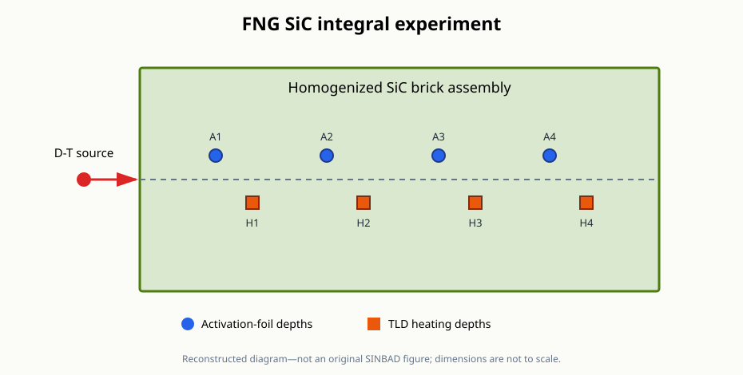

# FNG SiC integral experiment

This directory contains a preliminary MC/DC reconstruction of the [FNG SiC experiment](https://www.oecd-nea.org/science/wprs/shielding/sinbad/fng_sic/fngsic-a.htm) described by the public SINBAD entry NEA-1553/56.

It is not a transcription of the complete SINBAD package.

## Public-entry information

The experiment measured activation reaction rates and nuclear heating at several depths in a silicon-carbide block irradiated by the 14 MeV Frascati Neutron Generator.

| Item | Public-entry specification |
| --- | --- |
| Block | 45.72 cm × 45.72 cm × 71.12 cm |
| Construction | 116 sintered SiC bricks at an average density of 3.158 g/cm³ |
| Listed impurities | 0.19 wt% B, 0.79 wt% Al, and 0.14 wt% Fe |
| Source | FNG D-T source with angle-dependent intensity and energy, 5.3 cm before the block |
| Activation positions | 10.41, 25.65, 40.89, and 56.13 cm from the front surface |
| Activation reactions | Au-197(n,γ), Ni-58(n,p), Al-27(n,α), and Nb-93(n,2n) |
| Heating positions | 14.99, 30.23, 45.47, and 60.71 cm from the front surface |
| Heating detector | GR-200 LiF:Mg,Cu,P thermoluminescent dosimeters |

The public abstract catalogs the detailed source tables, measured responses, detector models, and calculation inputs, but those assets are not exposed by the currently accessible abstract page.

## Assumptions requiring official-package review

- The brick assembly is represented as one homogeneous rectangular block.
- The Si and C balance is assigned as stoichiometric SiC after subtracting the impurity fractions shown on the public page.
- The public TUD and FNG pages report different Al and Fe impurity fractions for the nominally shared block, so the official composition must be confirmed.
- The angle-energy-dependent source is replaced by an isotropic 14 MeV point source.
- Small mesh volumes sample the reported depths without explicitly modeling foils, TLDs, or their holders.
- The neutron energy grid uses 240 logarithmic bins from 10⁻⁹ to 20 MeV rather than an official group structure.
- The calculated spectra are not yet folded with the four dosimetry cross sections.
- TLD heating is not reproduced because the required neutron sensitivity and coupled neutron–photon transport are not yet included.
- The plots therefore show intermediate neutron flux spectra rather than the measured reaction rates and dose.

The complete package should refine the composition, brick and detector geometry, source distribution, response functions, and experimental comparison.

## Reconstructed diagram

The following diagram summarizes the public-entry description and is not an original SINBAD figure.

## Files

- `input.py` defines the neutron model and flux tallies at the activation and heating depths.
- `plot.py` plots the intermediate neutron spectra and their Monte Carlo uncertainties.
- `figures/` contains a reconstructed diagram based on the public entry.

MC/DC requires a native-data library containing the natural isotopes of Si, C, B, Al, and Fe.
