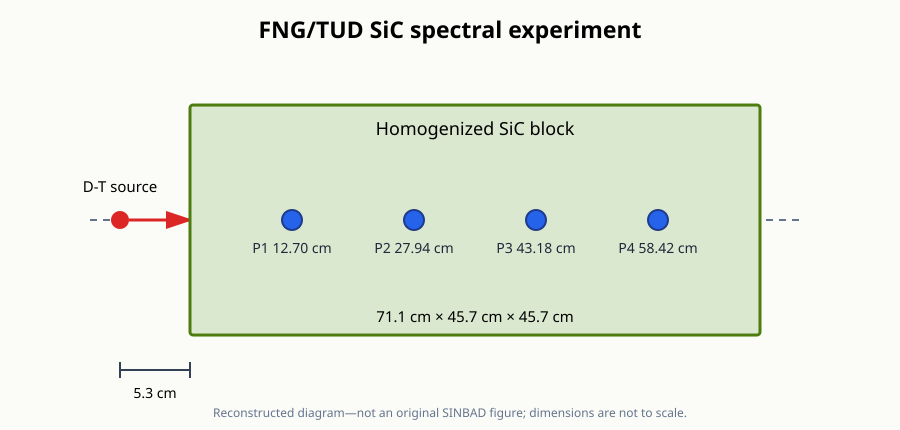

# FNG/TUD SiC spectral experiment

This directory contains a preliminary MC/DC reconstruction of the [FNG/TUD SiC experiment](https://www.oecd-nea.org/science/wprs/shielding/sinbad/tud_sic/tudsic-a.htm) described by the public SINBAD entry NEA-1553/70.

It is not a transcription of the complete SINBAD package.

## Public-entry information

The experiment measured neutron and photon flux spectra at four depths in a thick silicon-carbide block irradiated by the 14 MeV Frascati Neutron Generator.

| Item | Public-entry specification |
| --- | --- |
| Block | 45.7 cm × 45.7 cm × 71.1 cm along the measurement axis |
| Construction | SiC bricks represented in the published calculation at 3.158 g/cm³ |
| Composition | 68.9 wt% Si, 30.8 wt% C, 0.19 wt% B, 0.079 wt% Al, and 0.014 wt% Fe |
| Source | FNG D-T source with angle-dependent intensity and energy |
| Target stand-off | 5.3 cm before the block |
| Measurement positions | 12.70, 27.94, 43.18, and 58.42 cm along the central axis |
| Detector | Cylindrical NE-213 scintillator, 3.8 cm in diameter and height |
| Reported quantities | Absolute unfolded neutron and photon flux spectra |

The public abstract catalogs the detailed source tables, spectra, MCNP model, and figures, but those assets are not exposed by the currently accessible abstract page.

## Assumptions requiring official-package review

- The 116-brick assembly is represented as one homogeneous rectangular block.
- The reported target location is aligned with the x-axis used for the measurement depths.
- The angle-energy-dependent source is replaced by an isotropic 14 MeV point source.
- Small mesh volumes sample the four positions without explicitly modeling the NE-213 detector or its perturbation.
- The neutron energy grid uses 160 logarithmic bins from 0.001 to 20 MeV rather than the experimental bin boundaries.
- Only neutron transport is modeled because MC/DC does not yet support the coupled neutron–photon production required for the measured photon spectra.
- The plots contain no unfolded experimental spectra or detector-response treatment.

The complete package should refine the brick geometry, target assembly, source distribution, detector model, energy bins, and experimental comparison.

## Reconstructed diagram

The following diagram summarizes the public-entry description and is not an original SINBAD figure.

## Files

- `input.py` defines the neutron model and flux tallies at the four reported positions.
- `plot.py` plots the calculated neutron spectra and their Monte Carlo uncertainties.
- `figures/` contains a reconstructed diagram based on the public entry.

MC/DC requires a native-data library containing the natural isotopes of Si, C, B, Al, and Fe.
