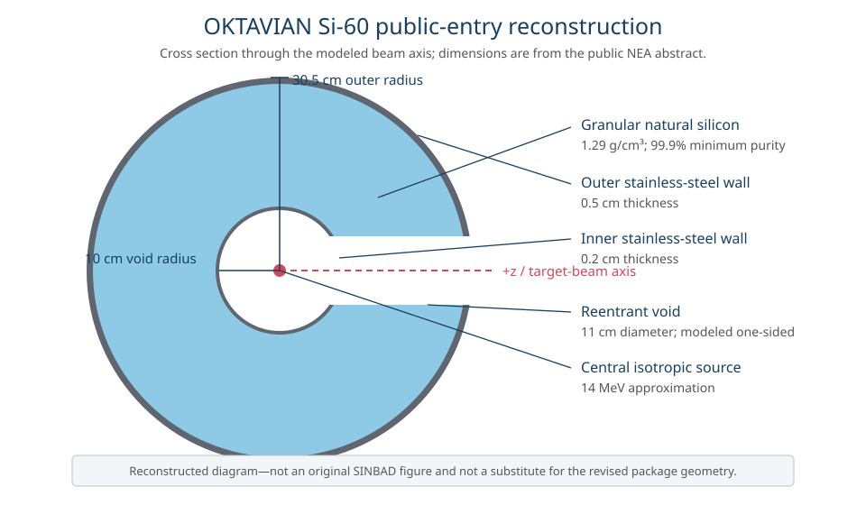
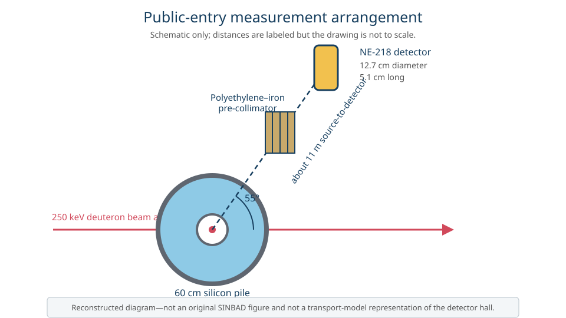

# OKTAVIAN Si-60

This directory contains a preliminary MC/DC reconstruction of the 60 cm silicon-sphere experiment described by the public [SINBAD OKTAVIAN silicon entry](https://www.oecd-nea.org/science/wprs/shielding/sinbad/oktav_si/oksi-abs.htm).

It is not a transcription of the licensed revised SINBAD package.

## Public-entry information

The experiment measured the neutron and neutron-induced photon leakage spectra from a granular silicon pile irradiated by the central D-T source at the OKTAVIAN facility.

The public entry gives the following information for the 60 cm configuration.

| Item | Public-entry specification |
| --- | --- |
| Outer vessel | 61.0 cm outer diameter |
| Central void | 20 cm diameter |
| Reentrant hole | 11 cm diameter target-beam hole |
| Vessel walls | 0.5 cm external and 0.2 cm internal thickness |
| Silicon | At least 99.9% pure granular silicon at 1.29 g/cm³ |
| Stainless steel | 18.5 wt% Cr, 70.4 wt% Fe, and 11.1 wt% Ni at 7.86 g/cm³ |
| Source | Central D-T source produced by 250 keV deuterons on a tritium target |
| Analysis assumption | Isotropic source direction |
| Neutron detector | NE-218 scintillator about 11 m away and 55° from the deuteron beam axis |
| Reported response | Outer-surface leakage current normalized per source neutron |

The public entry describes a tabulated source spectrum and measured leakage spectrum, but their numerical tables are distributed with SINBAD rather than exposed by the abstract page.

## Assumptions requiring official-package review

- The source is represented as an isotropic 14 MeV point source rather than the tabulated D-T source spectrum.
- The vessel is represented by concentric spherical shells, and the reentrant hole is assumed to be a one-sided void along the positive z-axis.
- The materials use the stated bulk compositions with natural elemental abundances, without additional impurities or construction details.
- Only neutron transport is modeled; the neutron-induced photon measurement is not yet included.
- The NE-218 detector and polyethylene–iron collimator are not included in the transport geometry.
- The tally integrates outward neutron current over the complete external vessel surface rather than selecting the detector's viewing direction at 55°.
- The energy grid uses 160 logarithmic bins from 0.01 to 20 MeV as a provisional development grid rather than the experimental bin boundaries.
- The plot contains no experimental overlay or detector-response treatment.

The complete official package should be used to refine the source, geometry, materials, directional tally, energy bins, detector-response treatment, and experimental comparison.

## Reconstructed diagrams

These diagrams summarize the public-entry description and are not reproductions of the original SINBAD figures.

## Files

- `input.py` defines the continuous-energy MC/DC model and outward leakage-current tally.
- `plot.py` converts the energy-bin currents to a differential spectrum and plots their Monte Carlo uncertainty.
- `figures/` contains reconstructed diagrams based on the dimensions and arrangement stated in the public entry.

MC/DC requires a native-data library containing the natural isotopes of Si, Cr, Fe, and Ni.
