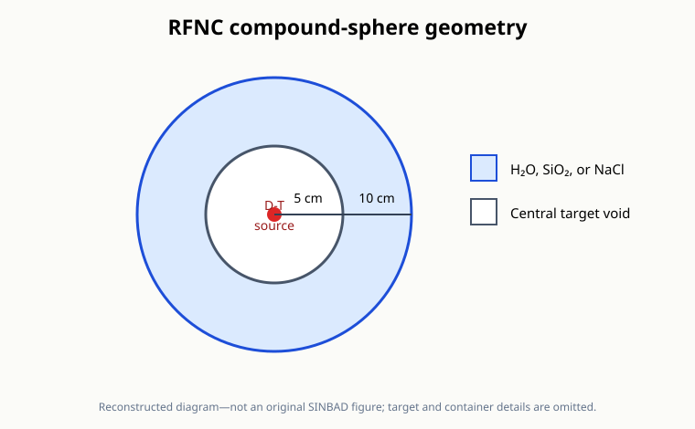
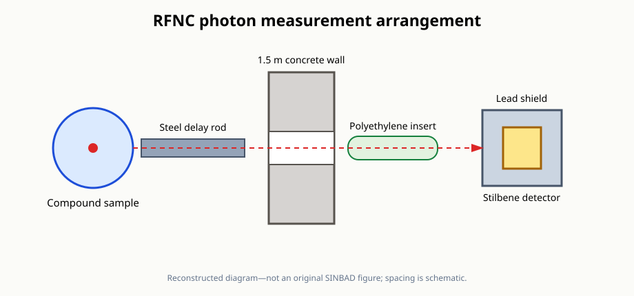

# RFNC photon spectra from H₂O, SiO₂, and NaCl

This directory contains a preliminary MC/DC geometry and neutron-transport precursor for the [RFNC compound experiment](https://www.oecd-nea.org/science/wprs/shielding/sinbad/rfnc_ph2/rfnc_g2-a.htm) described by the public SINBAD entry NEA-1517/80.

It is not yet a model of the benchmark's measured photon observable.

## Public-entry information

The experiment measured photon leakage spectra from spherical and hemispherical compound samples irradiated by a central 14 MeV neutron source.

| Item | Public-entry specification |
| --- | --- |
| Samples | H₂O, SiO₂, and NaCl spheres, plus SiO₂ and NaCl hemispheres |
| Inner diameter | 100 mm |
| Outer diameter | 200 mm |
| Source | Central D-T source from a 200 keV deuteron accelerator |
| Published calculation source | Isotropic, monoenergetic 14 MeV neutron source |
| Photon detector | 60 mm × 60 mm stilbene scintillator |
| Measured photon range | 0.3–8.0 MeV |
| Neutron suppression | 30 mm-diameter, 400 mm-long steel rod and a polyethylene insert |
| Shielding and collimation | 1.5 m concrete wall with a collimator and 50 mm lead detector shield |
| Reported uncertainty | 12% combined measurement uncertainty |

The public abstract catalogs sample parameters, measured spectra, an MCNP input, and figures, but those assets are not exposed by the currently accessible page.

## Current precursor

`input.py` defaults to the SiO₂ full-sphere configuration selected by the `SAMPLE` constant.

The available provisional full-sphere selections are `h2o-sphere`, `sio2-sphere`, and `nacl-sphere`.

The current tally is outgoing neutron current and is only a diagnostic of the neutron field that would drive photon production.

It must not be compared with the experimental photon spectrum.

## Assumptions requiring official-package review

- The sample is represented as a simple compound shell between radii of 5 and 10 cm.
- The source target, sample container, steel delay rod, collimator, shielding wall, polyethylene insert, and detector are omitted.
- Provisional material densities are used because the sample-parameter table is not available on the abstract page.
- Only the full-sphere variants are represented; the hemisphere orientation and container details require the complete geometry.
- The current MC/DC kernel does not provide the coupled neutron-induced photon production and photon transport needed by this benchmark.
- The neutron diagnostic uses 160 logarithmic bins from 0.001 to 20 MeV rather than an official neutron energy structure.
- The eventual photon tally must use the benchmark's experimental boundaries and detector-response treatment over the measured range.
- No experimental data are included in the plot.

The complete package and future MC/DC photon capability are both required before this precursor becomes a validation case.

## Reconstructed diagrams

These diagrams summarize the public-entry description and are not reproductions of original SINBAD figures.

## Files

- `input.py` defines the selectable full-sphere geometry and diagnostic neutron tally.
- `plot.py` plots the diagnostic neutron leakage and its Monte Carlo uncertainty.
- `figures/` contains reconstructed diagrams based on the public entry.

The selected configuration requires a native-data library containing the natural isotopes of its constituent elements.
